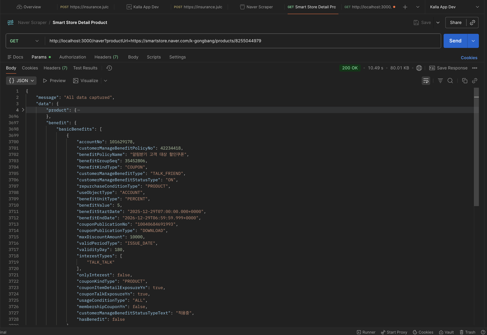

# Naver SmartStore Scraper

A sophisticated web scraper for Naver SmartStore product pages using Puppeteer with advanced anti-detection techniques and proxy support.

## 📋 Table of Contents

- [Features](#features)
- [Setup Instructions](#setup-instructions)
- [Run/Test Instructions](#runtest-instructions)
- [Scraper Explanation](#scraper-explanation)
- [API Documentation](#api-documentation)
- [Troubleshooting](#troubleshooting)

## ✨ Features

- **Anti-Bot Evasion**: Uses Puppeteer stealth mode and user agent anonymization
- **Proxy Support**: Full support for Korean residential proxies with authentication
- **Smart Fingerprinting**: Synchronizes timezone, headers, and browser language with proxy location
- **Organic Tab Forking**: Inherits cookies and session tokens by injecting links
- **API Response Capture**: Intercepts and returns both product and benefit data
- **Robust Error Handling**: Graceful fallback with partial data return
- **Human-like Behavior**: Mouse movements and scrolling simulation

---

<details>
<summary><strong>🚀 Setup Instructions</strong></summary>

### Prerequisites

- **Node.js** v16 or higher
- **npm** package manager
- **Chrome/Chromium** browser (optional - uses system Chrome if available)
- **Korean Residential Proxy** (required for Naver access)

### 1. Clone or Download the Project

```bash
cd /Users/dprastha/Developer/web-scraping/naver-smartstore-scraping
```

### 2. Install Dependencies

```bash
npm install
```

This installs:

- `express` - Web server framework
- `puppeteer` - Browser automation
- `puppeteer-extra` - Plugin system for Puppeteer
- `puppeteer-extra-plugin-stealth` - Anti-detection evasion
- `puppeteer-extra-plugin-anonymize-ua` - User agent anonymization
- `dotenv` - Environment variable management

### 3. Configure Environment Variables

Create or edit `.env` file in the project root:

```env
PORT=3000
PROXY_HOST=http://proxy.mrscraper.com:10000
PROXY_USER=hiring-country-kr
PROXY_PASS=guess
TIMEOUT=60000
```

**Important Notes:**

- `PROXY_HOST`: Korean residential proxy endpoint (datacenter proxies will be blocked)
- `PROXY_USER` & `PROXY_PASS`: Authentication credentials for the proxy
- `TIMEOUT`: Maximum wait time in milliseconds (60000ms = 60 seconds)
- `PORT`: Server port (default 3000)

### 4. (Optional) Use System Chrome

If you encounter Chromium launch errors, the scraper can use your system's Chrome:

```javascript
// In scraper-service.js, modify the launch options:
this.browser = await puppeteer.launch({
	executablePath: '/Applications/Google Chrome.app/Contents/MacOS/Google Chrome',
	headless: false,
	args: launchArgs,
	ignoreHTTPSErrors: true,
});
```

</details>

---

<details>
<summary><strong>🧪 Run/Test Instructions</strong></summary>

### 1. Start the Server

```bash
npm start
```

Expected output:

```
🚀 API Ready on port 3000
```

### 2. Test the API

#### Using curl:

```bash
curl "http://localhost:3000/naver?productUrl=https://smartstore.naver.com/k-gongbang/products/8255044979"
```

#### Using Postman:

1. Create a new GET request
2. URL: `http://localhost:3000/naver?productUrl=<YOUR_PRODUCT_URL>`
3. Send

#### Using Node.js/JavaScript:

```javascript
const productUrl = 'https://smartstore.naver.com/k-gongbang/products/8255044979';

fetch(`http://localhost:3000/naver?productUrl=${encodeURIComponent(productUrl)}`)
	.then((res) => res.json())
	.then((data) => console.log(JSON.stringify(data, null, 2)))
	.catch((err) => console.error('Error:', err));
```

### 3. Example Responses

#### Success (200 - All Data Captured):

```json
{
  "message": "All data captured",
  "data": {
    "product": {
      "productId": 8255044979,
      "productName": "Sample Product",
      "price": 29900,
      ...
    },
    "benefit": {
      "benefits": [...],
      "totalBenefits": 5
    }
  }
}
```




#### Partial Success (206 - Some Data Missing):

```json
{
  "message": "Partial content captured",
  "data": {
    "product": { ... },
    "benefit": null
  },
  "error": "429 BLOCKED. Your Proxy IP is likely blacklisted by Naver."
}
```

#### Error (4xx/5xx):

```json
{
	"error": "Failed to launch the browser process",
	"hint": "Ensure system Chrome is installed or use executablePath option"
}
```

</details>

---

<details>
<summary><strong>🛡️ Scraper Explanation</strong></summary>

### How It Works

The scraper uses a multi-layered approach to avoid detection and access Naver's protected content:

#### 1. **Evasion Strategies**

**Puppeteer Stealth Plugin**

- Removes `webdriver` property that identifies automation
- Hides `chrome` object detection
- Masks navigator properties
- Prevents headless detection

**User Agent Anonymization**

- Randomizes and rotates user agent strings
- Mimics real Chrome browser behavior
- Sets platform-specific headers (Windows user agent)

#### 2. **Fingerprint Masking**

```javascript
// Timezone Synchronization
await page.emulateTimezone('Asia/Seoul');

// Custom Headers (must match proxy location)
await page.setExtraHTTPHeaders({
	'Accept-Language': 'ko-KR,ko;q=0.9,en-US;q=0.8,en;q=0.7',
	'sec-ch-ua': '"Not_A Brand";v="8", "Chromium";v="120", "Google Chrome";v="120"',
	'sec-ch-ua-mobile': '?0',
	'sec-ch-ua-platform': '"Windows"',
	'Upgrade-Insecure-Requests': '1',
	'User-Agent': 'Mozilla/5.0 (Windows NT 10.0; Win64; x64) AppleWebKit/537.36...',
});
```

**Why this matters:**

- If IP is Korean but timezone is UTC, Naver flags it as suspicious → 429 error
- Language mismatch also triggers blocking
- All headers must align with proxy location

#### 3. **Proxy Integration**

**Proxy Authentication:**

```javascript
if (process.env.PROXY_USER && process.env.PROXY_PASS) {
	await page.authenticate({
		username: process.env.PROXY_USER,
		password: process.env.PROXY_PASS,
	});
}
```

**Why Residential Proxy?**

- Datacenter IPs (AWS, GCP) are immediately flagged by Naver
- Residential proxies appear as real ISP connections
- Korean residential proxy specifically required for Naver

#### 4. **Trust Building (The Magic Link Injection)**

```javascript
// Step 1: Load store homepage first (establishes session)
await page.goto(storeUrl);

// Step 2: Inject a link to the product and click it organically
// This inherits all cookies and session tokens from the store page
await page.evaluate((productUrl) => {
	const a = document.createElement('a');
	a.href = productUrl;
	a.target = '_blank';
	a.click();
}, this.targetProductUrl);

// Step 3: The new tab appears legitimate (same session cookies)
const productPage = await newPagePromise;
```

**Why this works:**

- Direct navigation to product page triggers bot detection
- Navigating from store → product looks organic
- Session cookies carry over → increased trust

#### 5. **Human-like Behavior**

```javascript
async simulateHumanWiggle(page) {
  await page.mouse.move(100, 100);
  await page.mouse.move(200, 200, { steps: 10 });
  await page.evaluate(() => window.scrollTo(0, 500));
  await this.sleep(1000);
}
```

#### 6. **Response Interception**

Captures API calls made by the page:

```javascript
newPage.on('response', async (response) => {
	const url = response.url();

	// Product data API
	if (url.includes('/i/v2/channels/') && url.includes('/products/')) {
		const productData = await response.json();
		this.capturedData.product = productData;
	}

	// Benefits data API
	if (url.includes('/benefits/by-products')) {
		const benefitData = await response.json();
		this.capturedData.benefits = benefitData;
	}
});
```

</details>

---

<details>
<summary><strong>📡 API Documentation</strong></summary>

### Endpoint: `GET /naver`

Scrapes product and benefit data from a Naver SmartStore product page.

#### Request

```
GET /naver?productUrl=<URL>
```

| Parameter    | Type   | Required | Description                       |
| ------------ | ------ | -------- | --------------------------------- |
| `productUrl` | string | Yes      | Full Naver SmartStore product URL |

#### Response Codes

| Code  | Message                  | Description                                          |
| ----- | ------------------------ | ---------------------------------------------------- |
| `200` | All data captured        | Both product and benefit data successfully captured  |
| `206` | Partial content captured | One or both data types partially captured or missing |
| `400` | Bad Request              | Missing `productUrl` parameter                       |
| `429` | Too Many Requests        | IP blocked by Naver (proxy blacklisted)              |
| `503` | Service Unavailable      | Connection issue or proxy rate limiting              |
| `500` | Internal Server Error    | Unexpected error                                     |

#### Response Body

```json
{
	"message": "All data captured|Partial content captured|No data captured",
	"data": {
		"product": {
			/* product API response or null */
		},
		"benefit": {
			/* benefit API response or null */
		}
	},
	"error": "error message (optional, only if error occurred)"
}
```

#### Example Requests

**cURL:**

```bash
curl -X GET "http://localhost:3000/naver?productUrl=https://smartstore.naver.com/k-gongbang/products/8255044979"
```

**JavaScript Fetch:**

```javascript
const url = new URL('http://localhost:3000/naver');
url.searchParams.append('productUrl', 'https://smartstore.naver.com/k-gongbang/products/8255044979');

const response = await fetch(url);
const data = await response.json();
console.log(data);
```

**Python Requests:**

```python
import requests

url = 'http://localhost:3000/naver'
params = {
    'productUrl': 'https://smartstore.naver.com/k-gongbang/products/8255044979'
}

response = requests.get(url, params=params)
print(response.json())
```

</details>

---

<details>
<summary><strong>🔧 Troubleshooting</strong></summary>

### Error: "Failed to launch the browser process"

**Cause:** Chromium not found or system incompatibility

**Solutions:**

1. Reinstall Puppeteer:

   ```bash
   npm install puppeteer --force
   ```

2. Use system Chrome (recommended for macOS):

   ```javascript
   executablePath: '/Applications/Google Chrome.app/Contents/MacOS/Google Chrome';
   ```

3. Check if Chrome is installed:
   ```bash
   ls /Applications/Google\ Chrome.app/
   ```

### Error: "429 BLOCKED. Your Proxy IP is likely blacklisted"

**Cause:** Proxy IP is blacklisted by Naver

**Solutions:**

1. Change proxy to a different Korean residential proxy
2. Update `.env` with new proxy credentials
3. Ensure proxy location is actually South Korea
4. Wait 24-48 hours before retrying (temporary blocks)

### Error: "Invalid URL format"

**Cause:** Product URL doesn't match Naver SmartStore pattern

**Solutions:**

1. Ensure URL starts with `https://smartstore.naver.com/` or `https://brand.naver.com/`
2. Include full product path: `/path-to-store/products/PRODUCT_ID`
3. URL encode special characters

### Timeout Errors

**Cause:** Page takes too long to load

**Solutions:**

1. Increase `TIMEOUT` in `.env` (e.g., 90000 for 90 seconds)
2. Check proxy connection speed
3. Reduce browser window size to speed up rendering
4. Try a different proxy with better performance

### Partial Data Captured

**Cause:** One or both APIs failed to load

**Possible reasons:**

- Page structure changed on Naver
- API endpoints modified
- Network timeout during capture
- JavaScript not fully executed

**Solutions:**

1. Check API response status codes in console logs
2. Verify API endpoint URLs haven't changed
3. Increase wait time in scraper (`await this.sleep(5000)`)
4. Try with different product URL to verify it's not product-specific

---

## 📝 Project Structure

```
naver-smartstore-scraping/
├── src/
│   ├── server.js              # Express server & /naver endpoint
│   └── scraper-service.js     # Core scraper logic
├── .env                        # Environment configuration
├── package.json               # Dependencies
└── README.md                  # This file
```

</details>

---

<details>
<summary><strong>⚖️ Legal Notice</strong></summary>

This scraper is provided for **educational purposes only**. Always check:

- Website's `robots.txt` and Terms of Service
- Local laws regarding web scraping
- Rate limiting to avoid overloading servers
- Naver's current scraping policies

Use responsibly and ethically.

</details>

---

<details>
<summary><strong>📞 Support</strong></summary>

For issues or questions:

1. Check the [Troubleshooting](#troubleshooting) section
2. Review console logs for detailed error messages
3. Verify `.env` configuration matches your proxy provider
4. Ensure system Chrome is up to date

</details>

---

**Last Updated:** January 8, 2026
**Version:** 1.0.0
